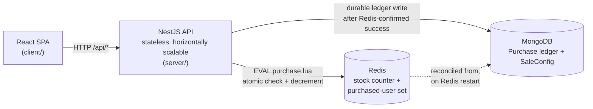

# Flash Sale

A backend + minimal frontend for a single-product, limited-stock flash sale that stays correct under thousands of concurrent purchase attempts: no overselling, no user buying more than once, graceful behavior outside the sale window.

The full spec is in [`PRD.md`](./PRD.md); the condensed build context (and a running changelog of decisions made along the way) is in [`CLAUDE.md`](./CLAUDE.md).

## Architecture



Redis is the source of truth **during the sale** for "is there stock" and "has this user already bought" — it's in-memory, single-threaded, and exactly the right tool for a short extreme burst against one hot counter and one hot uniqueness check. MongoDB is the durable ledger, written after a Redis-confirmed success, and is what Redis reconciles from if it restarts mid-sale.

## The concurrency mechanism

The atomic operation is a single Lua script run via Redis `EVAL` — one network round-trip, no window between the stock check and the decrement for another concurrent request to land in:

```lua
-- KEYS[1] = stock counter key, KEYS[2] = purchased-users set key
-- ARGV[1] = userId
if redis.call('SISMEMBER', KEYS[2], ARGV[1]) == 1 then
  return 'ALREADY_PURCHASED'
end
local stock = tonumber(redis.call('GET', KEYS[1]))
if not stock or stock <= 0 then
  return 'SOLD_OUT'
end
redis.call('DECR', KEYS[1])
redis.call('SADD', KEYS[2], ARGV[1])
return 'SUCCESS'
```

**Why this instead of two separate Redis calls (`GET` then `DECR`) from application code:** Redis executes one command at a time, and `EVAL` ships the entire check-then-mutate sequence as a single command. Two application-level calls leave a gap where a second request can read the same pre-decrement stock value and also proceed — the classic race that oversells the last unit. `userId` is always passed via `ARGV`, never string-interpolated into the script, to avoid injection.

**The alternative that was considered and rejected:** MongoDB alone can be made atomic per-document (`findOneAndUpdate` with a `stock > 0` filter, plus a unique index on `userId`). That's correct and is the simplest viable approach. But a flash sale is a short, extreme burst against a single hot document and a single hot index — exactly Redis's strength, not Mongo's. Redis was chosen for the hot path; Mongo stays as the durable, reconciled record.

## Design choices & trade-offs

- **Why NestJS over plain Express:** DI makes Redis/Mongo swappable for mocks in tests; `ValidationPipe` + DTOs give input validation largely for free; the module/controller/service structure is enforced discipline that matters for a role this focused on architecture. Framework choice doesn't affect the concurrency logic's correctness — that risk is identical under Express.
- **Why a stateless API:** enables horizontal scaling behind a load balancer — the scaling story, even though only one instance runs locally.
- **Restart reconciliation is real, not aspirational.** On boot, `PurchaseService` reconciles the Redis stock counter from Mongo — `totalStock - actualPurchaseCount`, written via `SET ... NX` so a live counter from an already-running instance is never clobbered — and re-seeds the purchased-users set via `SADD` from Mongo's distinct `userId`s. Since `attemptPurchase` requires Redis, no purchase can succeed while Redis is down, so Mongo's count is frozen during the outage and the recomputed value at restart is exact, not racy.
- **Known limitation: a failed Mongo write, followed by an uncontrolled Redis restart, can cause drift.** Redis is authoritative for the client-facing response — by the time Mongo is written, Redis has already decremented stock and marked the user as purchased. If that Mongo write fails (logged, not retried) and Redis is later restarted before anyone reconciles by hand, the restart's reconciliation won't know about that purchase: the unit's stock can be reopened and resold, and the original buyer could purchase again. This requires two independent low-probability events to coincide, so it's accepted rather than engineered around for this exercise. The production fix is named in the AWS mapping below (SQS write-behind) rather than built here.
- **`POST /purchase` always returns `200`.** The outcome (`success`/`sold_out`/`already_purchased`/`not_active`) lives in the response body, not the status code — a `201 Created` default would be wrong for the three outcomes where nothing was actually created.
- **Rate limiting is a network-abuse concern, not a correctness one.** `@nestjs/throttler` caps each IP at 30 requests/60s globally. It's overridden to a no-op guard in the e2e test suite rather than tuned around test traffic, since the concurrency guarantees are proven separately by the stress test.

## API surface

| Method | Path | Request | Response |
|---|---|---|---|
| GET | `/api/sale/status` | — | `{ status: upcoming\|active\|ended, startTime, endTime, stockRemaining }` |
| POST | `/api/purchase` | `{ userId: string }` | `{ result: success\|sold_out\|already_purchased\|not_active }` |
| GET | `/api/purchase/:userId` | — | `{ hasPurchased: boolean }` |

All input is validated server-side via DTOs + `class-validator` (unknown fields are rejected, not silently dropped). Sale window and stock are seeded via a `SaleConfig` Mongo document and checked against **server** time on every request — client-supplied time is never trusted. Unexpected errors return a generic `500` to the client; full detail is logged server-side only, via a global exception filter.

## Build & run

Requires Docker (for Mongo + Redis), Node.js, and npm.

```bash
# 1. Start Mongo + Redis
docker compose up -d

# 2. Backend
cd server
cp ../.env.example .env   # adjust if needed — defaults match docker-compose.yml
npm install
npm run start:dev         # http://localhost:3000/api

# 3. Frontend (separate terminal)
cd client
cp .env.example .env      # VITE_API_URL defaults to http://localhost:3000/api
npm install
npm run dev                # http://localhost:5173
```

### One-command dev startup

After the one-time `.env`/`npm install` setup above, the root `package.json` can start (or stop) everything — Mongo, Redis, backend, and frontend — in one go:

```bash
npm install            # once, at the repo root — installs concurrently/kill-port

npm run start:all       # docker compose up -d, then server + client together
npm run stop:all        # docker compose down, plus kills anything left on 3000/5173
```

`start:all` runs the backend and frontend concurrently in one terminal (`Ctrl+C` stops both); `stop:all` is the matching teardown for containers and stray processes.

No sale is configured out of the box. Seed one for manual testing with `server/scripts/seed-sale.ts` — it writes the matching `SaleConfig` doc and Redis stock/purchased-set in one step, so they can never drift out of sync the way two hand-typed `mongosh`/`redis-cli` commands could:

```bash
cd server
npm run seed -- --state=active --stock=5     # or --state=upcoming / --state=ended
```

The same script backs the Playwright fixtures below, so manual testing and CI seed sale state identically.

## Testing

```bash
cd server
npm run test        # unit tests — PurchaseService & SaleService, Redis/Mongo mocked via Nest DI
npm run test:e2e     # integration tests — full request lifecycle against real Mongo/Redis
npm run test:stress  # the concurrency proof, see below
```

- **Unit tests (21):** sold-out, duplicate user, success, sale-not-active, stock fallback, and Redis-restart reconciliation from the Mongo ledger — all with Redis/Mongo mocked.
- **Integration tests (12):** all 3 endpoints against real Mongo/Redis via `@nestjs/testing` + supertest — sale status, success/sold_out/already_purchased/not_active outcomes, `hasPurchased` checks, and DTO validation (missing/empty/extra-field rejection).

```bash
cd client
npm run e2e          # Playwright — drives the real UI against a running API
```

- **Browser tests (4):** `client/e2e/flash-sale.spec.ts` drives the built frontend through `upcoming` (buy attempt rejected), `active` (successful purchase), a repeat purchase by the same user (`already_purchased`), and a depleted-stock sale (`sold_out`) — each state seeded via `server/scripts/seed-sale.ts` before the run. Screenshots for each state land in `client/e2e/screenshots/`.

### CI

`.github/workflows/ci.yml` runs on every push and PR: server lint/unit/integration tests and a production build against real Mongo/Redis service containers, plus a client lint/build. On pull requests, a third job builds and boots the real API and frontend, runs the Playwright suite against them, and uploads the HTML report and per-state screenshots as build artifacts — so a reviewer can see the actual UI in each sale state without running anything locally.

### Stress test results

`server/test/stress/purchase-stress.ts` boots a real Nest application context and fires 5,400 concurrent purchase attempts directly at `PurchaseService` — 5,000 distinct users plus 200 users each re-fired twice more (shuffled in, so duplicates race real traffic instead of running safely at the end) — against a seeded stock of 100, at concurrency 300. It's deliberately in-process rather than over HTTP: there's no web server layer between the test and the actual bottleneck under test, the Lua `EVAL` against shared Redis state.

A real run on a Windows/Docker Desktop (WSL2) development machine:

| Metric | Result |
|---|---|
| Successes | **100** (exactly stock — zero oversell) |
| Sold out | 5,274 |
| Already purchased | 26 |
| Duplicate successes | **0** — no user ever succeeded twice, including under racing duplicate requests |
| Mongo ledger count | 100 (matches Redis-confirmed successes exactly) |
| Final Redis stock | **0** (never negative) |
| Throughput | ~1,184 req/s |
| Latency (p50 / p95 / p99) | 235ms / 352ms / 499ms |

The latency numbers reflect Docker Desktop's WSL2 network relay overhead on this machine, not the Lua script itself — a bare Redis `EVAL` is sub-millisecond. What matters for correctness is the invariant check, not the absolute latency: **zero oversell, zero double-purchase, exact ledger agreement**, holding under 5,400 concurrent, partially-racing requests.

## In production on AWS

No live deploy is required or included beyond the optional demo in `PRD.md` section 7. This maps the local setup to how it would run in production — and [`infra/production-reference/`](infra/production-reference/) is that mapping as real, `terraform validate`-clean Terraform rather than just prose, including autoscaling thresholds derived from the actual stress-test numbers below. It's deliberately never applied; see that module's own README for why.

| Concern | Local (this repo) | AWS in production |
|---|---|---|
| Compute | Docker Compose, single NestJS process | ECS Fargate, stateless tasks behind an ALB |
| Hot-path cache | Self-hosted Redis container | ElastiCache for Redis (same Lua `EVAL` semantics, Multi-AZ failover) |
| Durable store | Self-hosted MongoDB container | DocumentDB (AWS-native/IAM-integrated) or MongoDB Atlas (truer Mongo compatibility, multi-cloud) — pick one, justify against team's ops constraints |
| Frontend | Served locally / bundled | S3 + CloudFront |
| Secrets | `.env` | Secrets Manager / SSM Parameter Store |
| Observability | Console logs | CloudWatch metrics + alarms on stock-depletion rate and 5xx error rate specifically |
| CI/CD | GitHub Actions running tests | Same GitHub Actions, extended to push images to ECR and deploy to the ECS service |
| Scale-out (stretch) | N/A | SQS-based write-behind decoupling the Redis-confirmed response from the Mongo write — this is exactly the fix for the Mongo-write-failure drift gap named above |

## What wasn't built, and why

Explicitly out of scope for this exercise, per its own guidance against gold-plating:

- **A message queue implementation.** The SQS write-behind idea above is the real production fix for the one known correctness gap in this system — naming it and knowing exactly what it fixes is the point; building a queue here would be gold-plating a problem that requires two independent low-probability failures to actually manifest.
- **A live AWS deployment**, beyond the optional, no-cost Phase 7 demo (a single free-tier EC2 instance running the same `docker-compose.yml`) — see `PRD.md` sections 7 and 10.
- **Kubernetes, multi-region infrastructure, or a live-triggered autoscaling event.** The AWS mapping above documents the autoscaling story (ECS `aws_appautoscaling_policy` grounded in the stress-test numbers) as inspectable IaC rather than a costly live demo.

## Repo structure

```
bookipi-flash-sale/
├── README.md            # this file
├── CLAUDE.md             # build context + running changelog of decisions
├── PRD.md                # full spec
├── docker-compose.yml    # Mongo + Redis, local
├── server/               # NestJS API
│   ├── src/
│   │   ├── purchase/      # PurchaseModule: controller, service, dto, purchase.lua
│   │   ├── sale/           # SaleModule: controller, service
│   │   ├── redis/          # Redis provider + shared key names
│   │   └── common/filters/ # global exception filter
│   └── test/               # unit (co-located under src/), e2e, stress
└── client/                # React (Vite) frontend
```
